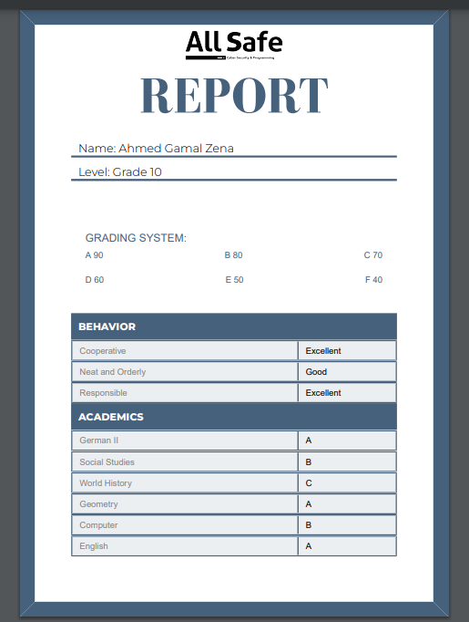

# All-safe-report Project Documentation

## Overview

This project, named `All-safe-report,` is an MVC (Model-View-Controller) structured application focusing on displaying reports in PDF format and download them too.
It supports internationalization (i18n) for right-to-left (RTL) languages and features dynamic report display functionalities.

## Installation

To set up the project:

```bash
npm install     # Installs all the dependencies
npm run dev     # Starts the development server
```

# Usage

`App.tsx` incorporates a `PDFViewer` from `@react-pdf/renderer` for displaying the report. Data is fetched from `ReportView.json` which is expected to be in the `public/data/` directory.

## Scripts

- `npm run dev`: Start the development server with Vite.
- `npm run build`: Compile TypeScript and build the app for production.

## MVC Architecture

This project adheres to the MVC architecture, separating the logic into distinct layers for more efficient development and maintenance.

## Dependencies

Key dependencies include:

- `@react-pdf/renderer`: For rendering PDFs.
- `i18next` suite: For internationalization support.
- `React`: For UI components.

## Contributing

Follow these steps to contribute:

1. Fork the repo.
2. Create a new feature branch.
3. Commit changes.
4. Push to the branch.
5. Open a pull request.

## Screenshots




## Portfolio

[Ahmed zena](ahmedzena.com)
